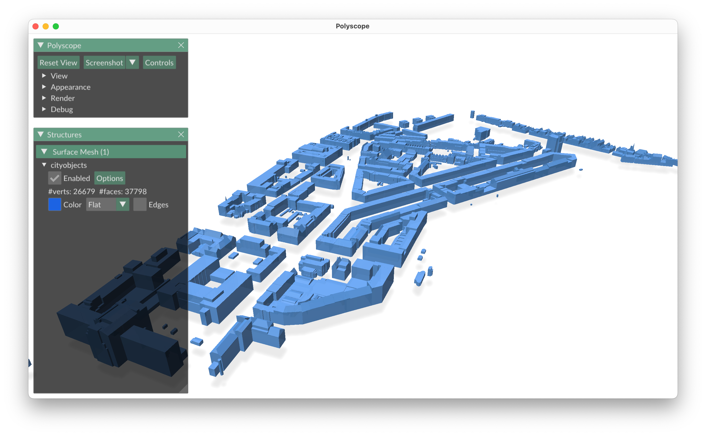

# cjseqview

A small python program to visualise [CityJSONSeq](https://cityjson.org/cityjsonseq) datasets.



## Dependencies

```bash
pip install mapbox_earcut
pip install polyscope
pip install numpy
pip install click
```

## Using cjfview

It reads a [CityJSONSeq](https://cityjson.org/cityjsonseq) from stdin.

```bash
cat ./data/b2.city.jsonl | python ./src/cjfview.py
```

```bash
cjio --suppress_msg Vienna_102081.city.json subset --random 5 export jsonl stdout | python ./src/cjfview.py --lod_filter 2
```


